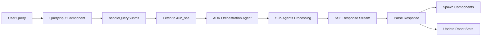

# Claude's Understanding of Multiagent Agency Project

## Project Overview
This is an Enterprise IQ Data Analytics Platform built with Next.js, React, Redux, and TypeScript. The platform features a revolutionary AI-driven canvas interface where users interact with an AI assistant that can dynamically spawn and control visualization components, creating an immersive data storytelling experience. The platform is organized into 4 main business domains, each containing analytical tools with Python backends and React/TypeScript frontends, all orchestrated by a sophisticated multi-agent AI system built with Google's Agent Development Kit (ADK).

## The Revolutionary AI Canvas System 🎨

### What Makes This Special
This platform introduces a groundbreaking approach to business intelligence where:
- **AI Controls the UI**: The AI doesn't just answer questions - it actively spawns, positions, and manipulates visualization components on an interactive canvas
- **Data Storytelling**: The AI narrates insights while simultaneously creating visual representations, turning data exploration into an engaging story
- **Natural Interaction**: Users can speak or type naturally, and the AI responds both verbally and visually
- **Contextual Intelligence**: The AI robot character uses laser pointers to guide attention and provides contextual explanations

### Canvas Architecture
The main application (`/apps/web/pages/index.js`) implements a sophisticated canvas system:
- **React Component Canvas**: Dynamic component positioning system using standard React components with CSS-based layout
- **Dynamic Component Registry**: 60+ visualization components ready to be spawned by AI
- **Component Management**: Each spawned component can be positioned, resized, minimized, or removed
- **State Persistence**: Canvas state and component positions are maintained throughout the session

### How AI Controls the UI
The AI achieves UI control through a carefully orchestrated system:

1. **User Query Processing**:
   ```javascript
   User → QueryInput → Backend AI (ADK) → Structured Response
   ```

2. **AI Response Structure**:
   ```json
   {
     "adk_last_response": "Let me show you the sales trends...",
     "visualization_output": [
       {
         "toolname": "sales-trends",
         "componentName": "timeSeriesExplorer",
         "body": { "start_date": "2023-01-01", "metric": "revenue" }
       }
     ]
   }
   ```

3. **Component Spawning**:
   - Frontend parses AI responses for component specifications
   - `spawnComponent()` function creates components at calculated positions
   - Components appear with smooth animations on the canvas

## AI Interaction Components

### 1. RobotCharacter (`/apps/web/ui-common/ai-interaction/RobotCharacter/`)
The AI assistant's visual representation on the canvas:
- **Draggable Avatar**: Users can position the robot anywhere on screen
- **State Animations**: Different animations for idle, thinking, speaking, and pointing states
- **Laser Pointer Integration**: Can point at specific components or data points
- **Speech Bubble**: Displays AI responses and contextual information
- **Voice Interface**: Integrated with text-to-speech for audio responses

### 2. LaserPointer Component
Visual guidance system for directing user attention:
- **AI Laser (Red)**: Used when AI points to components or insights
- **User Laser (Green)**: Shown when users select chart elements
- **Dynamic Tracking**: Follows component positions as canvas moves
- **Pulsing Animation**: Draws attention to important elements

### 3. QueryInput Component
Natural language interface for user communication:
- **Slash Commands**: Quick access to common operations
- **Voice Input**: Speech-to-text integration
- **Query History**: Recent queries for easy reuse
- **Auto-suggestions**: Context-aware command suggestions

## Communication Flow

### Frontend → Backend Flow


### Backend Response Processing
1. **Server-Sent Events (SSE)**: Real-time streaming of AI responses
2. **Response Parsing**: Extracts `adk_last_response` and component specifications from response
3. **Component Spawning**: Maps tool/component names to React components
4. **Position Calculation**: Smart positioning to avoid overlaps
5. **State Updates**: Robot character reflects processing state

## Tech Stack
- **Frontend**: Next.js, React 18, Redux Toolkit, TypeScript
- **Canvas**: React-based component positioning with CSS layout
- **Visualization**: Plotly.js, D3.js
- **Backend**: Python analytical tools
- **Database**: SQLite, MySQL
- **AI Integration**: 
  - Google Generative AI (Gemini 2.5) with function calling
  - Google Agent Development Kit (ADK)
  - Multi-agent orchestration system
  - Voice interface with Web Speech API
- **Styling**: Custom design system with predefined color tokens

## Dynamic Component Spawning System

### Component Registry
The system maintains a comprehensive registry of 60+ visualization components organized by tool domain:
```javascript
const componentRegistry = {
  'purchase-frequency': {
    histogram: dynamic(() => import('.../FrequencyHistogram')),
    heatmap: dynamic(() => import('.../IntervalHeatmap')),
    // ... more components
  },
  'sales-performance': {
    overview: dynamic(() => import('.../PerformanceOverview')),
    timeSeries: dynamic(() => import('.../TimeSeriesExplorer')),
    // ... more components
  },
  // ... more tools
}
```

### Spawn Process
1. **AI Decision**: ADK agents analyze query and decide which visualizations to create
2. **Component Specification**: AI returns structured data with tool, component, and props
3. **Dynamic Import**: Components are lazy-loaded using Next.js dynamic imports
4. **Smart Positioning**: Algorithm calculates optimal position to avoid overlaps
5. **Data Fetching**: Each component fetches its data based on AI-provided parameters
6. **Canvas Rendering**: Component appears with smooth animation at calculated position

### Example Spawn Flow
```javascript
// AI returns this in visualization_output:
{
  "toolname": "customer-segmentation",
  "componentName": "distributionMap",
  "body": {
    "start_date": "2023-01-01",
    "end_date": "2023-12-31",
    "segment_type": "behavioral"
  }
}

// Frontend spawns component:
await spawnComponent('customer-segmentation.distributionMap', props);
```

## AI-Driven Data Storytelling

### The Narrative Approach
This platform transforms traditional BI dashboards into interactive data stories:

1. **Context Building**: AI understands the business context from user queries
2. **Story Arc Creation**: Orchestration agent plans a narrative flow
3. **Visual Choreography**: Components are spawned in sequence to build the story
4. **Guided Exploration**: Robot character uses laser pointer to guide attention
5. **Interactive Dialogue**: Users can ask follow-up questions mid-story

### Storytelling Features
- **Progressive Disclosure**: Information revealed step-by-step
- **Visual Emphasis**: Laser pointer highlights key insights
- **Contextual Narration**: AI explains what's being shown and why
- **Adaptive Flow**: Story adjusts based on user interactions

### Example Story Flow
```
User: "Why are sales declining in Q4?"

AI Response & Actions:
1. "Let me investigate your Q4 sales performance..."
   → Spawns sales trend chart
2. "I notice a 15% decline starting in October..."
   → Laser points to specific data point
3. "Looking at regional breakdown..."
   → Spawns regional performance map
4. "The West region shows the steepest decline..."
   → Highlights specific region
5. "Let's examine product performance..."
   → Spawns product performance analyzer
```

## Project Structure

### 4 Business Domains
1. **Customer** (11 tools)
2. **Sales** (5 tools + performance_utils)
3. **Inventory** (5 tools)
4. **Finance** (1 tool)

### File Structure Pattern
```
apps/web/{DOMAIN}/tools/{tool}/
├── {tool}.py                    # Python backend logic
├── Spec_UI_{tool}.md            # UI/UX specification document
├── tests/                       # Python tests
│   └── test_{tool}.py
├── ui/                          # Frontend implementation
│   ├── api/                     # API integration
│   │   └── functionCalls.ts
│   ├── components/              # React components
│   │   ├── kpi/                # KPI tiles
│   │   ├── visualizations/     # Chart components
│   │   └── controls/           # Filter/control components
│   ├── types/                   # TypeScript definitions
│   │   └── index.ts
│   ├── state/                   # Redux slices (if applicable)
│   └── views/                   # Main dashboard views
├── api/                         # Additional API files
└── database/                    # Database queries
```

### Page Routing
- Pages are in `/apps/web/pages/`
- Customer tools: `/pages/customers/{tool-name}.js`
- Sales tools: `/pages/sales/{tool-name}.js`
- Inventory tools: `/pages/inventory/{tool-name}.js`
- API endpoints: `/pages/api/{tool-name}/data.js`

## All Tools by Domain

### Customer Domain Tools (12 tools)
1. **anomaly_detection** - Detects unusual patterns in customer behavior
2. **churn_prediction** - Predicts customer churn likelihood
3. **customer_behaviour** - Analyzes customer behavior patterns
4. **customer_lifetime_value** - Calculates and predicts customer LTV
5. **customer_segmentation** - Segments customers into groups
6. **engagement_classifier** - Classifies customer engagement levels
7. **next_purchase** - Predicts next purchase timing/products
8. **next_purchase_predictor** - Advanced prediction for next purchases
9. **performance_deviation** - Identifies performance deviations
10. **purchase_frequency** - Analyzes purchase frequency patterns
11. **retention_planner** - Plans retention strategies
12. **transaction_patterns** - Analyzes transaction patterns

### Sales Domain Tools
1. **DemandForecastEngine** - Forecasts product demand
2. **ProductPerformanceAnalyzer** - Analyzes product performance metrics
3. **RegionalSalesAnalyzer** - Analyzes sales by region
4. **SalesPerformanceAnalyzer** - Overall sales performance analysis
5. **SalesTrendAnalyzer** - Identifies and analyzes sales trends
6. **performance_utils** - Utility functions for performance calculations

### Inventory Domain Tools
1. **InventoryHoldingCostAnalyzer** - Analyzes inventory holding costs
2. **InventoryLevelAnalyzer** - Monitors inventory levels
3. **InventoryOptimizationAnalyzer** - Optimizes inventory management
4. **SlowMovingInventoryAnalyzer** - Identifies slow-moving items
5. **StockOptimizationRecommender** - Recommends stock optimization

### Finance Domain Tools
1. **financial_tool** - Financial analysis and reporting

## UI Specification Structure
Each `Spec_UI_{tool}.md` file contains:
1. **Tool Overview** - Purpose and capabilities
2. **Data Analysis & Patterns** - Data elements and analysis methods
3. **Current vs Target State** - What exists vs what's needed
4. **UI Component Design** - Detailed component specifications including:
   - Dimensions
   - Colors (using design tokens)
   - Interactions
   - States
   - Visual elements

## Design System Tokens
- **Primary Colors**:
  - Electric Cyan: #00e0ff
  - Signal Magenta: #e930ff
  - Midnight Navy: #0a1224
  - Cloud White: #f7f9fb
- **Component Standards**:
  - KPI Tiles: Standardized format across tools
  - Visualizations: Plotly-based interactive charts
  - Controls: Consistent filter and control patterns

## Common UI Patterns
1. **Dashboard Structure**:
   - KPI tiles row at top
   - Main visualizations in grid layout
   - Filter controls in sidebar or top bar
   - Data tables with drill-down capability

2. **API Integration**:
   - Next.js API routes in `/pages/api/`
   - Frontend calls via `/api/{tool-name}/data`
   - Redux for state management (where applicable)
   - TypeScript for type safety

3. **Component Organization**:
   - `views/` - Main dashboard component
   - `components/kpi/` - KPI tile components
   - `components/visualizations/` - Chart components
   - `components/controls/` - Filter/control components
   - `api/functionCalls.ts` - API integration logic

## Current Implementation Status
- Most tools have basic UI implementations
- Mix of JavaScript and TypeScript files
- Some tools have Redux integration, others use local state
- Varying levels of completion vs specifications

## Key Observations
1. **Inconsistencies**: Some tools use .js, others .tsx
2. **Migration in Progress**: Evidence of ongoing migration (ENTERPRISE_DATA_CONNECTOR_MIGRATION_PLAN.md)
3. **Shared Components**: Common UI components in `/ui-common/`
4. **API Gateway**: Centralized API gateway in `/api-gateway/`
5. **Design System**: Partial implementation of design system components

## Verification Approach
To verify UI alignment with specifications:
1. Parse each Spec_UI file to extract requirements
2. Check for corresponding UI implementation files
3. Verify component structure matches spec
4. Validate visual properties (dimensions, colors)
5. Check data flow and API integration
6. Document gaps and misalignments
7. Prioritize fixes based on business impact

## AI System Architecture

### Google ADK Multi-Agent System (`/apps/adk/`)
The project includes a sophisticated multi-agent AI system built with Google's Agent Development Kit (ADK):

#### 1. **Orchestration Agent** (`/apps/adk/orchestration_agent/`)
- **Main entry point**: `agent.py`
- **Role**: Decomposes high-level user requests into subtasks and dispatches to specialized sub-agents
- **Key features**:
  - Never asks for parameters - uses provided values or defaults
  - Automatic error handling and retry logic
  - Voice interface optimization
  - Context maintenance across sessions

#### 2. **Specialized Sub-Agents**:
- **Customer Insights Agent**: Handles all customer-related analytics
- **Sales Analyst Agent**: Manages sales performance and forecasting
- **Financial Agent**: Processes financial analysis and reporting
- **Inventory Manager Agent**: Optimizes inventory and stock levels

#### 3. **Tool Integration**:
All Python tools from `/apps/web/{DOMAIN}/tools/` are integrated into the ADK system at `/apps/adk/orchestration_agent/tools/`, providing:
- Unified access to all analytics capabilities
- Consistent parameter handling
- Automated tool selection based on user intent

### Gemini AI Integration (`/apps/web/ui-common/utils/api/geminiClient.js`)
The frontend includes a sophisticated Gemini 2.5 client for AI-powered UI interactions:

#### Key Features:
1. **Function Calling System**: 
   - Register UI functions that Gemini can call directly
   - Automatic function execution based on user queries
   - Type-safe function declarations using JSON Schema
   - Example registration:
   ```javascript
   registerFunction({
     name: 'spawnVisualization',
     description: 'Creates a new visualization on the canvas',
     parameters: {
       type: 'object',
       properties: {
         toolName: { type: 'string', description: 'Tool identifier' },
         componentName: { type: 'string', description: 'Component to spawn' },
         props: { type: 'object', description: 'Component properties' }
       }
     }
   }, async (args) => {
     return await spawnComponent(`${args.toolName}.${args.componentName}`, args.props);
   });
   ```

2. **Visualization Intelligence**:
   - `explainVisualization()`: AI explains charts and data patterns
   - `getSuggestions()`: Proactive action recommendations based on app state
   - Context-aware analysis of displayed components

3. **Interactive UI Components**:
   - Query input with natural language processing
   - AI-powered insights and recommendations
   - Context-aware responses based on canvas state

### AI-Powered UI Components (`/apps/web/ui-common/ai-interaction/`)
1. **RobotCharacter**: Visual AI assistant representation
2. **SpeechBubble**: AI response display component
3. **LaserPointer**: AI-guided attention direction
4. **ProductInsightAssistant**: Domain-specific AI helper

### AI Configuration
- **Models**: Gemini 2.5 Pro (default), with support for Groq and Cerebras
- **Function calling**: Full support for UI automation
- **Voice interface**: Optimized for conversational interactions
- **Error handling**: Automatic retry and fallback mechanisms

## Detailed Sub-Agent Implementations

### 1. Customer Insights Agent
**Role**: Specializes in analyzing customer behavior, segmentation, satisfaction, and lifetime value. Serves as the customer intelligence center.

**Instruction Key Points**:
- Never asks for parameters - uses provided values or defaults
- Default time frame for segmentation: 2017 to 2021
- Analyzes all segments by default
- Uses industry standard thresholds (e.g., 0.95 for service levels)

**Tools Available** (12 total):
1. **analyze_customer_behavior** - Comprehensive behavior pattern analysis
2. **identify_customer_segments** - ML-based customer segmentation
3. **predict_customer_ltv** - Customer lifetime value prediction using advanced models
4. **predict_churn_risk** - Churn probability calculation with risk factors
5. **analyze_performance_deviations** - Identifies unusual performance patterns
6. **predict_next_purchases** - Next purchase timing and product predictions
7. **next_purchase_predictor** - Advanced next purchase predictions
8. **analyze_transaction_patterns** - Transaction behavior analysis
9. **detect_anomalies** - Isolation Forest-based anomaly detection
10. **analyze_purchase_frequency** - Purchase pattern and frequency analysis
11. **analyze_customer_engagement** - Engagement level classification
12. **plan_retention_actions** - Strategic retention planning

### 2. Sales Analyst Agent
**Role**: Analyzes sales performance metrics, pipeline analysis, sales forecasting, and channel effectiveness. Serves as the sales intelligence center.

**Tool Registration System**: Uses priority-based registration through `register_tools()` function
- Highest priority: Product performance analysis
- Medium priority: Sales performance and trends
- Lowest priority: Demand forecasting

**Tools Available** (5 total):
1. **analyze_regional_sales**
   - Multi-dimensional regional analysis
   - Performance comparison across regions
   - Visualization support

2. **analyze_product_performance**
   - Parameters: metrics=['sales', 'units', 'margin', 'price_bands']
   - Category levels: product, category, subcategory
   - Includes margin analysis and price band distribution

3. **analyze_sales_performance**
   - Dimensions: product, category, channel, region, customer, time
   - Metrics: revenue, units, AOV, growth, margin
   - Comparison modes: period-over-period, year-over-year

4. **analyze_sales_trends**
   - Time periods: daily, weekly, monthly, quarterly, annual
   - Trend analysis with forecasting
   - Top N breakdown by dimension

5. **demand_forecast**
   - ML-based forecasting (Random Forest, XGBoost)
   - Period types: month, quarter, year
   - Pattern analysis included

### 3. Financial Agent
**Role**: Analyzes financial data, calculates key financial metrics, identifies trends, and generates insights for business decision-making.

**Database**: Uses `financial_agent.db` with fixed path configuration

**Tools Available** (2 total):
1. **cash_flow_analysis**
   - Analyzes cash flow patterns over time
   - Default period: Last complete period
   - Generates visualizations with Plotly

2. **revenue_forecast**
   - ML-powered revenue forecasting
   - Default: 30 days ahead
   - Uses ensemble models for accuracy

### 4. Inventory Manager Agent
**Role**: Responsible for analyzing and optimizing inventory operations to minimize costs while ensuring adequate stock levels.

**Default Parameters**:
- Service levels: 0.95 (95%)
- Annual holding cost: 25%
- Opportunity cost rate: 8%
- Aging threshold: 180 days
- Turnover threshold: 1.0

**Tools Available** (4 total):
1. **analyze_holding_costs**
   - Calculates inventory holding costs
   - Includes opportunity cost analysis
   - Category and warehouse filtering

2. **analyze_inventory_levels**
   - Stock level monitoring
   - Min stock threshold: 0.1 (10%)
   - Stockout risk assessment

3. **analyze_slow_moving_inventory**
   - Identifies slow-moving items
   - Turnover and aging analysis
   - Disposal recommendations

4. **optimize_stock_levels**
   - EOQ calculations
   - Safety stock optimization
   - Reorder point recommendations

## Agent Communication & Best Practices

### 1. Parameter Handling Philosophy
**Core Principle**: "Never ask for parameters - use values provided or defaults"
- All agents are instructed to proceed immediately with analysis
- Default values are carefully chosen based on industry standards
- Time periods default to the most recent complete period
- All categories/segments included unless specified

### 2. Error Handling Pattern
- Automatic retry logic built into orchestrator
- Agents return structured error responses
- Orchestrator adjusts parameters and retries on failure
- Configurable retry limits with graceful degradation

### 3. Voice Interface Optimization
- Dual output format: text and speak
- Speak output optimized for natural conversation
- Progress updates during tool execution
- Engaging and interactive responses

### 4. Tool Selection Intelligence
- Orchestrator decomposes requests into subtasks
- Each subtask mapped to best-suited agent
- Parallel execution where possible
- Context maintained across tool calls

## Database Architecture

### 1. **customers.db**
- Used by Customer Insights Agent
- Contains transaction, behavior, and segmentation data
- Tables include customer profiles, transactions, engagement metrics

### 2. **sales_agent.db**
- Used by Sales Analyst Agent
- Contains sales transactions, product catalog, regional data
- Optimized for time-series analysis

### 3. **financial_agent.db**
- Used by Financial Agent
- Contains P&L data, cash flow records, financial metrics
- Structured for financial reporting and forecasting

### 4. **inventory.db**
- Used by Inventory Manager Agent
- Contains stock levels, movements, cost data
- Includes warehouse and product hierarchies

## Tool Integration Architecture

### 1. Dual Implementation Pattern
- **Web Implementation**: Individual Python files in `/apps/web/{DOMAIN}/tools/`
- **ADK Integration**: Consolidated in `/apps/adk/orchestration_agent/tools/`
- Shared utility functions and database connections

### 2. Registration System
- Tools registered with metadata (name, description, function)
- Priority-based registration for optimal selection
- Type hints and documentation for all parameters

### 3. Visualization Integration
- Tools can generate Plotly visualizations
- Base64 encoding for web transport
- Interactive charts with drill-down capabilities

### 4. State Management
- Session state maintained by orchestrator
- Tool outputs aggregated for final response
- Context preserved for follow-up queries

## ADK System Features

### 1. Model Flexibility
```python
model = envModel  # Default: gemini-2.5-flash
if modelProvider == "groq":
    model = LiteLlm(model=f"groq/{envModel}")
elif modelProvider == "cerebras":
    model = LiteLlm(model=f"cerebras/{envModel}")
```

### 2. Agent Configuration
- Each agent has specific instructions and tool access
- Clear capability descriptions for routing
- Output schemas for structured responses

### 3. Execution Flow
1. User request → Orchestrator
2. Request decomposition → Subtasks
3. Subtask routing → Specialized agents
4. Tool execution → Results
5. Result aggregation → Final response

## Comprehensive Guidelines for Adding New Tools and Agents

### Prerequisites
Before adding new tools or agents, ensure you understand:
1. The ADK (Agent Development Kit) architecture
2. Python tool development patterns
3. React/TypeScript component development
4. Database schema design
5. The canvas-based UI system

### Part A: Adding a New Tool

#### 1. Tool Naming Conventions
```
Backend Tool: {action}_{entity} (e.g., analyze_customer_behavior, predict_churn_risk)
Frontend Tool: {Entity}{Action} (e.g., CustomerBehaviorAnalyzer, ChurnPredictor)
Component Names: {Description}{ChartType} (e.g., EngagementPyramid, RiskDistributionMap)
```

#### 2. Backend Tool Structure
Create the Python tool file: `/apps/web/{DOMAIN}/tools/{tool_name}/{tool_name}.py`

```python
# Standard imports
import pandas as pd
import numpy as np
from typing import Dict, List, Optional, Tuple
import json
import base64
from datetime import datetime

def {tool_function_name}(
    start_date: Optional[str] = None,
    end_date: Optional[str] = None,
    # Add other parameters with defaults
) -> Dict:
    """
    Tool description following Google docstring format.
    
    Args:
        start_date: Start date in YYYY-MM-DD format
        end_date: End date in YYYY-MM-DD format
        
    Returns:
        Dict containing:
        - status: 'success' or 'error'
        - data: Analysis results
        - summary: Text summary for AI narration
        - visualization_output: Array of components to spawn
        - insights: Key findings list
    """
    try:
        # 1. Parameter validation and defaults
        if not start_date:
            start_date = (datetime.now() - timedelta(days=365)).strftime('%Y-%m-%d')
        
        # 2. Database connection
        db_path = get_db_path('{domain}.db')
        
        # 3. Data processing
        # ... your analysis logic ...
        
        # 4. Generate visualizations (optional)
        fig = create_plotly_figure(data)
        
        # 5. Prepare response
        return {
            'status': 'success',
            'data': processed_data,
            'summary': f"Analysis completed for {start_date} to {end_date}",
            'visualization_output': [{
                'toolname': '{tool-name}',
                'componentName': '{componentName}',
                'body': {
                    'start_date': start_date,
                    'end_date': end_date,
                    # Other props for the component
                }
            }],
            'insights': [
                'Key insight 1',
                'Key insight 2'
            ],
            'chart': fig.to_json() if fig else None
        }
    except Exception as e:
        return {
            'status': 'error',
            'error': str(e),
            'data': None
        }
```

#### 3. Create UI Specification
Create `/apps/web/{DOMAIN}/tools/{tool_name}/Spec_UI_{tool_name}.md`:

```markdown
# {Tool Name} UI Specification

## Tool Overview
Brief description of what this tool does and its business value.

## Data Analysis & Patterns
- Input data requirements
- Analysis methods used
- Expected output patterns

## UI Component Design

### KPI Tiles
1. **{Metric Name}**
   - Dimensions: 280x120px
   - Primary metric: Font size 36px, Electric Cyan (#00e0ff)
   - Trend indicator: ↑/↓ with percentage
   - Background: Midnight Navy (#0a1224)

### Visualizations
1. **{Visualization Name}**
   - Type: {Chart type}
   - Dimensions: {Width}x{Height}px
   - Interactive features: {List features}
   - Color scheme: {Define colors}

## API Contract
```json
{
  "endpoint": "/api/{tool-name}/data",
  "method": "POST",
  "request": {
    "filters": {
      "startDate": "YYYY-MM-DD",
      "endDate": "YYYY-MM-DD"
    }
  },
  "response": {
    "data": {},
    "summary": "string",
    "insights": []
  }
}
```
```

#### 4. Create Test File
Create `/apps/web/{DOMAIN}/tools/{tool_name}/tests/test_{tool_name}.py`:

```python
import pytest
from {tool_name} import {tool_function_name}

def test_{tool_function_name}_basic():
    """Test basic functionality"""
    result = {tool_function_name}(
        start_date='2023-01-01',
        end_date='2023-12-31'
    )
    assert result['status'] == 'success'
    assert 'data' in result
    assert 'visualization_output' in result

def test_{tool_function_name}_error_handling():
    """Test error handling"""
    result = {tool_function_name}(
        start_date='invalid-date'
    )
    assert result['status'] == 'error'
```

#### 5. ADK Integration
Add to `/apps/adk/orchestration_agent/tools/{tool_name}.py`:

```python
from orchestration_agent.tools.{domain}.{tool_name} import {tool_function_name} as original_{tool_function_name}

def {tool_function_name}_with_viz(**kwargs):
    """Wrapper that ensures visualization output"""
    result = original_{tool_function_name}(**kwargs)
    
    # Ensure visualization_output is present
    if 'visualization_output' not in result:
        result['visualization_output'] = []
    
    return result

# Register the tool
{tool_function_name} = {tool_function_name}_with_viz
```

### Part B: Adding a New Agent

#### 1. Agent Naming Convention
```
Agent Class: {Domain}Agent (e.g., MarketingAgent, SupplyChainAgent)
Agent Variable: {domain}_agent (e.g., marketing_agent, supply_chain_agent)
Agent Name: {domain}_insights_agent (e.g., marketing_insights_agent)
```

#### 2. Create Agent Directory Structure
```
/apps/adk/orchestration_agent/agents/{domain}/
├── __init__.py
├── agent.py
├── instructions.py
├── tools/
│   ├── __init__.py
│   ├── tool1.py
│   └── tool2.py
└── tests/
    └── test_agent.py
```

#### 3. Define Agent Instructions
Create `/apps/adk/orchestration_agent/agents/{domain}/instructions.py`:

```python
{DOMAIN}_AGENT_INSTR = """
You are a {Domain} specialist AI agent focused on {specific responsibilities}.

CORE RESPONSIBILITIES:
1. {Responsibility 1}
2. {Responsibility 2}
3. {Responsibility 3}

IMPORTANT RULES:
1. NEVER ask for additional parameters - use provided values or industry-standard defaults
2. Always proceed with analysis immediately
3. Include visualization_output in your responses for UI spawning
4. Provide both 'text' and 'speak' outputs for dual-mode interface
5. Make insights actionable and specific

DEFAULT PARAMETERS:
- Time period: Last 12 months if not specified
- Segments: All segments unless specified
- Thresholds: Use industry standards
  - {Threshold 1}: {Value}
  - {Threshold 2}: {Value}

VISUALIZATION GUIDELINES:
When user asks about {topic}, spawn these components:
- For trends: Use timeSeriesExplorer
- For distributions: Use distributionMap
- For comparisons: Use comparisonMatrix
- For KPIs: Always include KPI tiles

OUTPUT FORMAT:
Return responses in this structure:
{
  "text": "Detailed explanation for UI display",
  "speak": "Conversational summary for voice interface",
  "visualization_output": [
    {
      "toolname": "tool-name",
      "componentName": "componentName",
      "body": { ...props }
    }
  ]
}
"""
```

#### 4. Implement the Agent
Create `/apps/adk/orchestration_agent/agents/{domain}/agent.py`:

```python
from google.adk.agents import Agent
from .instructions import {DOMAIN}_AGENT_INSTR
from .tools import (
    tool1_function,
    tool2_function,
    # ... other tools
)

def create_{domain}_agent(model):
    """Create and configure the {Domain} agent"""
    
    # Register all tools
    tools = [
        tool1_function,
        tool2_function,
        # ... other tools
    ]
    
    # Create agent
    agent = Agent(
        name="{domain}_insights_agent",
        model=model,
        instruction={DOMAIN}_AGENT_INSTR,
        description="Handles {domain} analytics including {list key capabilities}",
        tools=tools,
        output_key="{domain}_analysis"
    )
    
    return agent
```

#### 5. Update Orchestration Agent
In `/apps/adk/orchestration_agent/agent.py`, add:

```python
# Import new agent
from orchestration_agent.agents.{domain}.agent import create_{domain}_agent

# Create agent instance
{domain}_agent = create_{domain}_agent(model)

# Add to orchestrator's sub-agents
root_agent = Agent(
    name="orchestration_agent",
    model=model,
    instruction=ROOT_AGENT_INSTR,
    description="Root orchestration agent",
    agents=[
        customer_agent,
        sales_agent,
        financial_agent,
        inventory_agent,
        {domain}_agent  # Add new agent here
    ]
)
```

#### 6. Create Database Schema
If the agent needs a new database, create `/apps/adk/orchestration_agent/agents/{domain}/schema.sql`:

```sql
-- {Domain} Database Schema
CREATE TABLE IF NOT EXISTS {entity}_data (
    id INTEGER PRIMARY KEY AUTOINCREMENT,
    created_at TIMESTAMP DEFAULT CURRENT_TIMESTAMP,
    -- Add domain-specific columns
);

CREATE INDEX idx_{entity}_date ON {entity}_data(created_at);
```

### Part C: Frontend Integration

#### 1. Add Components to Registry
In `/apps/web/pages/index.js`, add to componentRegistry:

```javascript
const componentRegistry = {
  // ... existing tools ...
  '{tool-name}': {
    dashboard: dynamic(() => import('../{Domain}/tools/{tool_name}/ui/views/{Tool}Dashboard')),
    kpiTiles: dynamic(() => import('../{Domain}/tools/{tool_name}/ui/components/kpi/KPITiles')),
    mainVisualization: dynamic(() => import('../{Domain}/tools/{tool_name}/ui/components/visualizations/MainChart')),
    // Add all components this tool can spawn
  },
};
```

#### 2. Add Data Fetching Logic
In `spawnComponent` function, add:

```javascript
} else if (toolName === '{tool-name}') {
  console.log(`[Canvas DEBUG] Fetching {tool name} data for ${componentName}`);
  
  const response = await fetch('/api/{tool-name}/data', {
    method: 'POST',
    headers: { 'Content-Type': 'application/json' },
    body: JSON.stringify({
      filters: {
        start_date: props.start_date || defaultStartDate,
        end_date: props.end_date || defaultEndDate,
        // Map other parameters
      }
    })
  });
  
  const data = await response.json();
  
  // Component-specific data mapping
  switch(componentName) {
    case 'kpiTiles':
      componentSpecificData = {
        metrics: data.kpi_metrics,
        trends: data.trends
      };
      break;
    // Add cases for other components
  }
}
```

#### 3. Create API Endpoint
Create `/apps/web/pages/api/{tool-name}/data.js`:

```javascript
import { exec } from 'child_process';
import { promisify } from 'util';

const execAsync = promisify(exec);

export default async function handler(req, res) {
  if (req.method !== 'POST') {
    return res.status(405).json({ error: 'Method not allowed' });
  }

  try {
    const { filters } = req.body;
    
    // Prepare Python command
    const args = [
      `start_date="${filters.start_date || ''}"`,
      `end_date="${filters.end_date || ''}"`,
      // Add other parameters
    ].join(' ');
    
    const command = `cd apps/web && python -c "
from {Domain}.tools.{tool_name}.{tool_name} import {tool_function_name}
import json
result = {tool_function_name}(${args})
print(json.dumps(result))
"`;

    const { stdout, stderr } = await execAsync(command);
    
    if (stderr) {
      console.error('Python error:', stderr);
      return res.status(500).json({ error: 'Analysis failed' });
    }
    
    const result = JSON.parse(stdout);
    res.json(result);
    
  } catch (error) {
    console.error('API error:', error);
    res.status(500).json({ error: error.message });
  }
}
```

### Testing Guidelines

#### 1. Backend Testing
```bash
# Test individual tool
pytest apps/web/{DOMAIN}/tools/{tool_name}/tests/test_{tool_name}.py

# Test agent
pytest apps/adk/orchestration_agent/agents/{domain}/tests/test_agent.py
```

#### 2. Integration Testing
```bash
# Test end-to-end flow
curl -X POST http://localhost:8001/run_sse \
  -H "Content-Type: application/json" \
  -d '{"user_query": "Test query for new tool"}'
```

#### 3. UI Testing Checklist
- [ ] Component renders without errors
- [ ] Data loads correctly
- [ ] Interactions work (hover, click, drill-down)
- [ ] Responsive at different canvas zoom levels
- [ ] Error states handled gracefully
- [ ] Loading states shown appropriately

### Documentation Requirements

For each new tool/agent, update:
1. This CLAUDE.md file with the new tool/agent details
2. README in the tool directory
3. API documentation
4. Component storybook (if applicable)
5. User-facing documentation

### Validation Checklist

Before considering a tool/agent complete:
- [ ] Python tool follows naming conventions
- [ ] All default parameters defined
- [ ] Visualization output format correct
- [ ] Tests pass (unit and integration)
- [ ] UI components registered
- [ ] API endpoint created and tested
- [ ] spawnComponent handles the tool
- [ ] Agent instructions include the tool
- [ ] Documentation complete
- [ ] Code reviewed by team lead

## Developer Guide: Adding AI-Controllable Components

### Step 1: Create the Component
1. Add your visualization component to the appropriate tool directory:
   ```
   /apps/web/{DOMAIN}/tools/{tool}/ui/components/visualizations/YourComponent.tsx
   ```

2. Ensure component accepts props that AI can provide:
   ```typescript
   interface YourComponentProps {
     data?: any;
     filters?: {
       startDate?: string;
       endDate?: string;
       metric?: string;
     };
     onDataUpdate?: (data: any) => void;
   }
   ```

### Step 2: Register in Component Registry
Add your component to the registry in `/apps/web/pages/index.js`:
```javascript
const componentRegistry = {
  'your-tool': {
    yourComponent: dynamic(() => 
      import('../{DOMAIN}/tools/{tool}/ui/components/visualizations/YourComponent')
    ),
  }
}
```

### Step 3: Update ADK Agent
1. Add visualization logic to the relevant agent's tool:
   ```python
   # In the tool function
   visualization_output = [{
     "toolname": "your-tool",
     "componentName": "yourComponent",
     "body": {
       "start_date": start_date,
       "metric": metric
     }
   }]
   ```

2. Update agent instructions to know when to use this visualization

### Step 4: Add Data Endpoint
Create API endpoint if needed:
```javascript
// /apps/web/pages/api/your-tool/data.js
export default async function handler(req, res) {
  const { filters } = req.body;
  // Fetch and process data
  res.json({ data: processedData });
}
```

### Step 5: Handle in spawnComponent
Add case in spawnComponent function for data fetching:
```javascript
} else if (toolName === 'your-tool') {
  const response = await fetch('/api/your-tool/data', {
    method: 'POST',
    headers: { 'Content-Type': 'application/json' },
    body: JSON.stringify(props)
  });
  const data = await response.json();
  componentSpecificData = { data: data.data, ...props };
}
```

## Best Practices for AI-Controlled UI

### 1. Component Design
- **Self-Contained**: Components should be fully functional with just props
- **Loading States**: Include skeleton loaders for async data
- **Error Boundaries**: Graceful error handling with user-friendly messages
- **Responsive**: Components must work at various canvas zoom levels

### 2. AI Instructions
- **Clear Descriptions**: Help AI understand when to use each component
- **Parameter Defaults**: Always provide sensible defaults
- **Context Awareness**: Consider what other components are on canvas

### 3. Data Flow
- **Efficient Fetching**: Use appropriate caching strategies
- **Real-time Updates**: Consider WebSocket for live data
- **Progressive Loading**: Load essential data first

### 4. User Experience
- **Smooth Animations**: Use React Spring for component entry
- **Clear Visual Hierarchy**: Important data should stand out
- **Interactive Elements**: Enable drill-downs and filters
- **Accessibility**: Ensure keyboard navigation and screen reader support

## Real-World Example Interactions

### Example 1: Multi-Component Analysis
```
User: "Show me why customer churn increased last quarter"

System Flow:
1. Query → ADK Orchestration Agent
2. Agent delegates to Customer Insights Agent
3. Customer Agent analyzes request, determines need for:
   - Churn trend visualization
   - Risk distribution
   - Feature importance analysis

4. Backend Response:
{
  "adk_last_response": "I've analyzed your customer churn data for last quarter. The churn rate increased from 5.2% to 7.8%, primarily driven by pricing sensitivity and decreased engagement. Let me show you the details...",
  "visualization_output": [
    {
      "toolname": "churn-prediction",
      "componentName": "temporalRisk",
      "body": { "period": "Q4-2023", "granularity": "weekly" }
    },
    {
      "toolname": "churn-prediction", 
      "componentName": "featureImportance",
      "body": { "top_n": 10 }
    },
    {
      "toolname": "churn-prediction",
      "componentName": "riskPyramid", 
      "body": { "segments": ["high", "medium", "low"] }
    }
  ]
}

5. Canvas Updates:
   - Three components spawn in sequence
   - Robot moves and points to key insights
   - User can interact with each visualization
```

### Example 2: Cross-Domain Investigation
```
User: "Compare sales performance with inventory costs"

System Flow:
1. Orchestration Agent identifies need for both Sales and Inventory agents
2. Parallel processing by multiple agents
3. Coordinated response with mixed visualizations
4. Components from different domains appear on same canvas
5. AI narrates the relationships between metrics
```

### Example 3: Drill-Down Interaction
```
User: [Clicks on a data point in sales chart]
Robot: "I see you're interested in the November spike. Let me analyze this further..."

System Flow:
1. Click event captured with chart coordinates
2. Context passed to AI with selected data point details
3. AI spawns detailed view component
4. Laser pointer connects original point to new visualization
5. Narrative explanation of the anomaly
```

## Canvas Interaction Patterns

### User-Initiated Actions
- **Natural Language Queries**: Type or speak questions
- **Direct Manipulation**: Click, drag, resize components
- **Contextual Queries**: Select data points then ask questions
- **Voice Commands**: "Show me sales for California"

### AI-Initiated Actions
- **Proactive Insights**: AI suggests relevant visualizations
- **Guided Tours**: Step-by-step exploration of data
- **Anomaly Highlighting**: Automatic attention to outliers
- **Predictive Spawning**: AI anticipates next questions

### Mixed-Initiative Interaction
- **Collaborative Exploration**: User and AI take turns
- **Context Building**: Each interaction adds to shared understanding
- **Adaptive Responses**: AI adjusts based on user behavior
- **Learning Patterns**: System adapts to user preferences

## Troubleshooting Common Issues

### Component Not Spawning
1. Check component registry path is correct
2. Verify ADK agent returns proper visualization_output format
3. Ensure spawnComponent has handler for your tool
4. Check browser console for dynamic import errors

### AI Not Using Your Component
1. Review agent instructions mention the component
2. Check tool function includes visualization_output
3. Verify component description in registry
4. Test with explicit prompts mentioning the visualization

### Data Not Loading
1. Verify API endpoint path matches fetch URL
2. Check request/response formats match
3. Ensure proper error handling in API
4. Monitor network tab for failed requests

### Canvas Performance Issues
1. Limit number of simultaneous components (recommend < 10)
2. Implement virtualization for large datasets
3. Use React.memo for expensive components
4. Consider progressive data loading

### SSE Connection Problems
1. Check CORS configuration for backend
2. Verify SSE endpoint URL is correct
3. Implement reconnection logic for dropped connections
4. Add timeout handling for long-running queries

## Notes for Future Work
- Consider standardizing file extensions (.tsx vs .js)
- Complete Redux integration where beneficial
- Ensure all tools follow the same component structure
- Implement missing visualizations per specifications
- Add comprehensive TypeScript types for all tools
- Expand AI function calling capabilities for more UI interactions
- Implement AI-driven dashboard customization
- Add more sophisticated error recovery in the orchestration agent
- Create visual component library documentation
- Add component preview mode for developers
- Implement canvas state persistence across sessions
- Add collaborative features for multi-user canvas